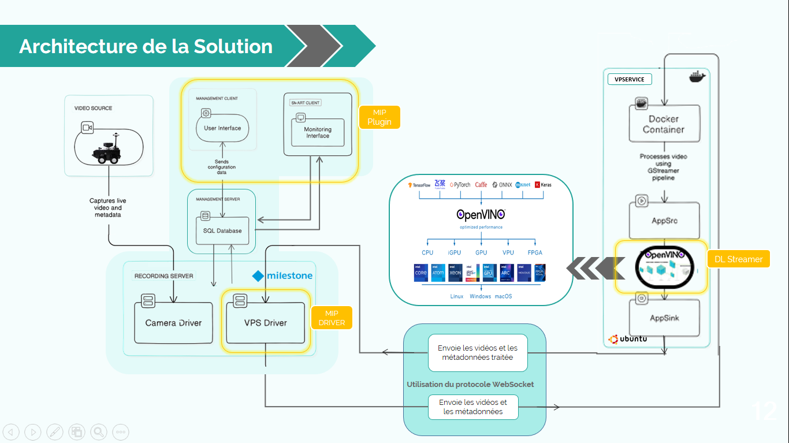
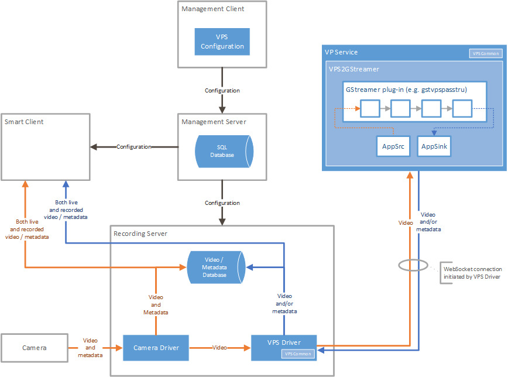
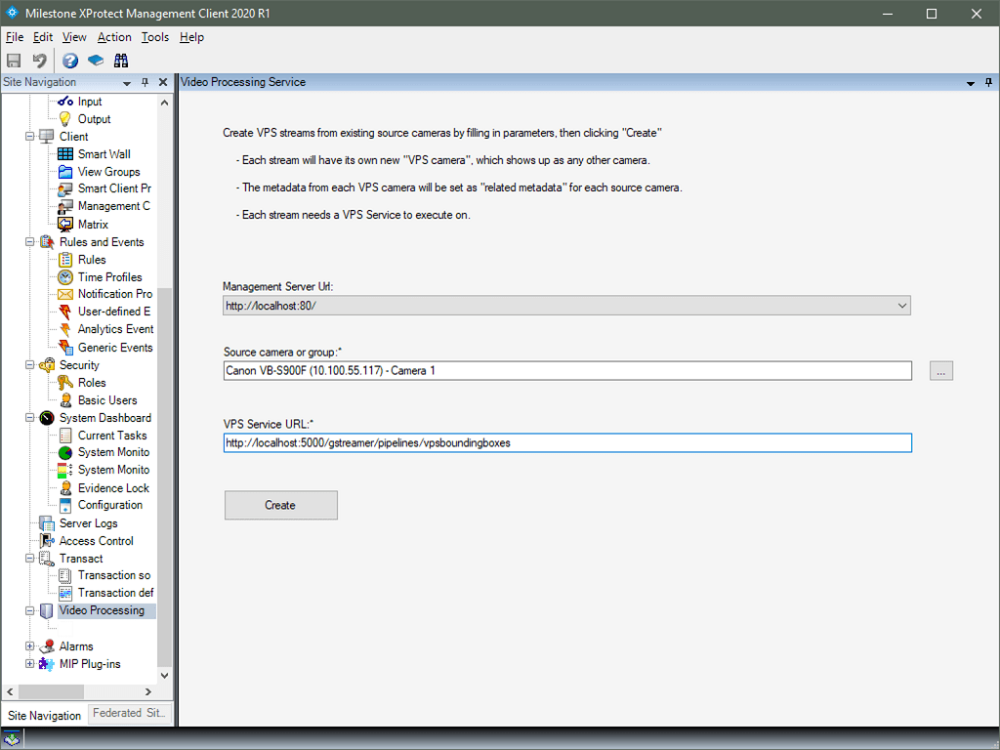
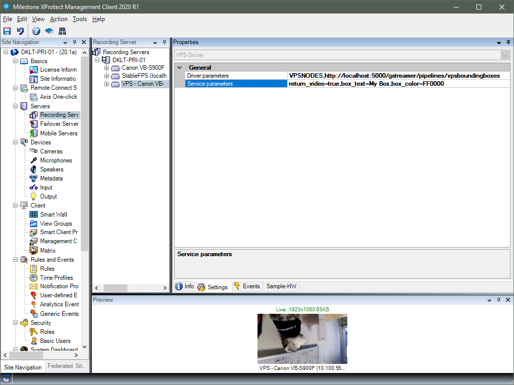

# Video Processing Service (VPS) for Real-Time Video Analytics
## Project Overview
> This project involves the development of a Video Processing Service (VPS) integrated with Milestone XProtect VMS for real-time video stream analysis. The VPS is capable of detecting objects such as people, vehicles, and faces using advanced AI models optimized with OpenVINO and DL Streamer. The goal is to enhance the security capabilities of the PGuard robot by enabling real-time video analytics and providing metadata to the VMS.

## Key Features
* Real-Time Object Detection: Integration of object detection models (people, vehicles, faces) using OpenVINO and DL Streamer for real-time video processing.
* WebSocket Communication: Established communication between the VPS and the Milestone XProtect VMS via WebSocket for real-time data exchange.
* Docker Integration: The VPS is deployed using a Docker container to ensure flexibility, scalability, and seamless integration into various environments.
* Command Interface: A plugin for XProtect Smart Client allows the user to control the VPS Docker container directly from the VMS interface, enabling or disabling the service as needed.
* Metadata Handling: The VPS processes video streams and generates metadata that is sent back to the VMS for triggering alarms and other automated actions.
## XProtect Smart Client Interface
The XProtect Smart Client provides an intuitive interface for managing and interacting with the VPS. From the Smart Client, users can:

* Start/Stop the VPS Service: Using the "Run Service" and "Stop Service" buttons, users can control the VPS Docker container directly from the interface. When activated, the VPS starts processing video streams in real-time.
* View Real-Time Analytics: The metadata generated by the VPS (e.g., detected objects such as people, vehicles, or faces) is displayed in the Smart Client, allowing security personnel to monitor events as they happen.
* Trigger Alarms: Based on the metadata sent by the VPS, the VMS can trigger alarms and automatically record video segments, which are then stored for later review.
* Alarm Preview and List: The Smart Client allows users to preview video footage associated with specific alarms and review all triggered alarms in an organized list for immediate action or later analysis.
This seamless integration enhances the overall security management workflow, making it easier for users to monitor, control, and respond to events in real-time.

## Technologies Used
* OpenVINO: For optimizing AI models and performing real-time inference on video streams.
* DL Streamer: A GStreamer-based framework used for integrating deep learning models into the video processing pipeline.
* Docker: Used to deploy and manage the VPS in a lightweight, portable container.
* WebSocket: Ensures real-time communication between the VPS and the Milestone XProtect VMS.
* Milestone XProtect: A robust video management system (VMS) used to monitor and analyze video streams.
* MIP SDK: Used to develop plugins and drivers to integrate the VPS with XProtect.
## How It Works
> Video Stream Processing: The VPS captures video streams from IP cameras, which are processed through a GStreamer pipeline that integrates DL Streamer and OpenVINO.
> Object Detection and Metadata Generation: AI models detect objects in the video streams (people, vehicles, faces), and the system generates corresponding metadata.
> WebSocket Communication: The VPS communicates with the Milestone XProtect VMS via WebSocket, sending metadata in real-time for further analysis.
> VMS Integration: The plugin in XProtect Smart Client manages the VPS service, allowing users to start or stop the video processing service directly from the VMS interface.
> Alarm Triggers: Based on the metadata generated by the VPS, the VMS triggers alarms and stores recordings for further analysis.

# Video Processing Service Toolkit

## Disclaimer

> The Video Processing Service Toolkit contains pre-production samples intended to accelerate your implementation of a solution. However, the samples are not intended for production without modification. In addition to modifying pipelines to fit your use cases, you must harden security of endpoints and other critical tasks to secure your solution.

## Content

1. [Overview](#overview)
2. [VPS Toolkit contents](#vps-toolkit-contents)
3. [Exploring the VPS Toolkit sample](#exploring-the-vps-toolkit-sample)
4. [Installing the VPS Configuration Management Client plugin](#installing-the-vps-configuration-management-client-plugin)
5. [Setting up VP Service on Windows](#setting-up-vp-service-on-windows)
6. [Adding VPS devices](#adding-vps-devices)
7. [Moving a VPS device between recording servers](#moving-a-vps-device-between-recording-servers)

## Overview

The *VPS Toolkit* is a MIP SDK toolkit that allows you to forward video from an XProtect camera device to a GStreamer pipeline. Video and/or metadata output from the GStreamer pipeline can be brought back into the XProtect VMS through a VPS Driver-based device. However, this is not mandatory; it is up to you how to consume the output of the GStreamer pipeline.

Below is shown an overview diagram of an XProtect VMS setup where the *VPS Toolkit* is processing video and sending it back into the XProtect VMS.

The orange arrows illustrate how video and metadata flows through the system originating from a real camera. Video and metadata is captured by a *Camera Driver* and forwarded to be optionally recorded on disk and optionally sent as a live feed to the *Smart Client*. This is how the flow of video and metadata normal works in a XProtect VMS.

The *VPS Toolkit* adds the ability to forward the feed (currently only video) unmodified through a *VPS Driver*. The *VPS Driver* pushes video to a *VP Service* which can then process the video using a GStreamer pipeline. Optionally, the video and/or metadata output from the GStreamer pipeline can be sent back through the *VPS Driver* into the XProtect VMS. This is shown in the diagram with the blue arrows. The feed coming back from the *VP Service* is received by the *VPS Driver* and is exposed through a new camera device and a new metadata device. From here on, the video and/or metadata feeds can be used just as if they had come from a physical camera device. For example, you can record the feed and watch both the live feed and recorded data in the *Smart Client*.

The *VPS Toolkit* provides a *Management Client* plugin named *VPS Configuration* to help configure this setup. The plugin offers a convenient way to select camera sources and specify the *VP Service* and GStreamer plugin to process the feeds.

### VPS Driver

*VPS Driver* is an integral part of XProtect version 2020 R1 and later.

> The VPS Toolkit is not supported in XProtect releases before version 2020 R1.

### VP Service

*VP Service* is a .NET Core 3.1 web application. As such, it runs unmodified on Microsoft and Linux.

### Vps2GStreamer

The Vps2GStreamer component is the binding between GStreamer and the C# service part of VPS. It is a C++ component including a P/Invoke interface with a few functions, `PutData` and `GetData` being the most important ones. `PutData` is used to push data from the C# part of the VPS into the GStreamer part, and `GetData` to get data out. Setting up and configuring the GStreamer pipeline happens in the private method `SetupGStreamer` of the `Vps2GStreamer` class.

### GStreamer plugins

*VPS Toolkit* includes these GStreamer plugins:

* `vpspasstru`
* `vpsjpegtranscoder`
* `vpsboundingboxes`

`vpspasstru` simply passes video directly from input to output without modifying anything. If you use this plugin, you will basically just get a camera device in XProtect that shows the same video as the input camera device, a little delayed.

`vpsjpegtranscoder` will decode the video it receives (e.g. H.264) and encode it to JPEG. Visually, the experience will be similar to that of the `vpspasstru` plugin, but the video format of the new camera device will always be JPEG, no matter what the input format is.

`vpsboundingboxes` appends a bounding box in ONVIF format to each frame. Visually, in the Smart Client you will see a green bounding box moving across the view item for the new camera device. `vpsboundingboxes` also demonstrates how to pass parameters to a GStreamer plugin.

The plugins provided use standard GStreamer elements, and there is no GPU acceleration involved.

> For further samples of interesting plugins, check out the NVIDIA DeepStream SDK (<https://developer.nvidia.com/deepstream-sdk>). Note that DeepStream is for Linux only.

<!-- end of intro -->

<!-- start of sample -->

## VPS Toolkit contents

~~~txt
mipsdk-samples-vps/
├── VpsToolkit/
│   ├── VpsConfiguration/
│   │   └── VpsConfiguration.sln
│   ├── VPService/
│   │   ├── Meta/
│   │   ├── Plugins/
│   │   ├── Vps2GStreamer/
│   │   ├── VPService/
│   │   ├── VpsUtilities/
│   │   ├── VPService.sln
│   │   └── Makefile
│   ├── README.md
│   ├── VPSConfig.png
│   ├── VPSHardware.png
│   ├── VPSOverview.png
│   └── VPS-Protocol.md
├── README.md
└── LICENSE.md
~~~

`mipsdk-samples-vps/VpsToolkit/VpsConfiguration` contains source files for the *VPS Configuration* Management Client plugin.

`mipsdk-samples-vps/VpsToolkit/VPService` contains source files for *VP Service*.

## Exploring the VPS Toolkit sample

To run the sample included in the VPS Toolkit, perform the following tasks:

1. Install the *VPS Configuration* Management Client plugin

2. Set up one or more *VP Service* instances on Windows or Linux

3. Use the *VPS Configuration* Management Client plugin to add VPS devices

## Installing the VPS Configuration Management Client plugin

The solution file is located in `mipsdk-samples-vps/VpsToolkit/VpsConfiguration/VpsConfiguration.sln`.

To deploy the *VPS Configuration* plugin:

1. Open and build `VpsConfiguration.sln`

2. Exit the Management Client.

3. If the MIP SDK Tray Manager is running, exit it (right-click the MIP SDK Tray Manager icon in the System Tray and select "Exit Tray Manager").

4. Copy the following files from the output folder of the build into a subdirectory (VpsConfiguration) of the MIPPlugins directory in your XProtect VMS installation:

   * `plugin.def`
   * `VpsConfiguration.dll`

   For example, open a command prompt as Administrator inside the build output folder and execute the following commands:

   ~~~cmd
   mkdir "%ProgramFiles%\Milestone\MIPPlugins\VpsConfiguration"
   copy /Y plugin.def "%ProgramFiles%\Milestone\MIPPlugins\VpsConfiguration"
   copy /Y VpsConfiguration.dll "%ProgramFiles%\Milestone\MIPPlugins\VpsConfiguration"
   ~~~

5. Start the Management Client. You should see a new node named *Video Processing Service* near the bottom in the Site Navigation view.

6. You can restart the MIP SDK Tray Manager from the Windows Start menu.6

## Setting up VP Service on Windows

The solution file `mipsdk-samples-vps/VpsToolkit/VPService/VPService.sln` contains projects for VPService, GStreamer, and all GStreamer plugins.

The solution will output all files built to `mipsdk-samples-vps/VpsToolkit/VPService/bin/$(Configuration)/`.

The solution and binaries depend on Visual Studio 2019 16.4 (or later), .NET Core 3.1, and MSVC 64-bit GStreamer 1.18 (or later).

### Installing GStreamer on Windows

If you have not already installed MSVC 64-bit GStreamer 1.18 development and runtime packages, follow the instructions at <https://gstreamer.freedesktop.org/documentation/installing/on-windows.html>.

With GStreamer 1.18, please select the "Complete" install mode. VPS will not run if you select "Typical".

The *VP Service* solution and binaries expect the environment variable `GSTREAMER_1_0_ROOT_MSVC_X86_64` to be set, and the GStreamer installer will do so. If Visual Studio was open during the GStreamer installation, close and reopen Visual Studio.

### Installing .NET Core 3.1 on Windows

The binaries requires .NET Core Runtime 3.1 to be installed. If in doubt, run this command:

~~~cmd
dotnet --list-runtimes
~~~

The solution requires .NET Core Development Tools 3.1 to be installed. If in doubt, run this command:

~~~cmd
dotnet --list-sdks
~~~

You can download .NET Core 3.1 installers from <https://dotnet.microsoft.com/download/dotnet/3.1>.

### Building VP Service on Windows

Open and build `mipsdk-samples-vps/VpsToolkit/VPService/VPService.sln`.

If needed, first change the build mode (dropdown in upper middle of VS) from Docker or IIS Express to `VPService`.

### Running VP Service on Windows

To run `VPService`, press F5 in Visual Studio, or execute these commands in the directory `mipsdk-samples-vps/VpsToolkit/VPService/bin/$(Configuration)/`:

~~~cmd
set GST_DEBUG=2
set GST_PLUGIN_PATH=.
dotnet VPService.dll
~~~

You can configure the port that `VPService` listens on by editing `appsettings.Production.json` (or `appsettings.Development.json` when running from Visual Studio). If you want to run multiple `VPService` instances on the same host, they must listen on different ports.

You can configure logging in several ways:

* To control logging for GStreamer, set the environment variable `GST_DEBUG`

* To control logging for `VPService`
  * Edit `NLog.config`
  * Override `NLog.config` by appending `-log_debug` or `-log_trace` to the command line like this:

    ~~~cmd
    set GST_DEBUG=2
    set GST_PLUGIN_PATH=.
    dotnet VPService.dll -log_debug
    ~~~

## Setting up VP Service on Linux

A number of packages are required to build and run *VP Service* on Linux. In these instructions, we will assume Ubuntu 18.04, but you should be able to adopt the instructions for any current Linux distribution. For more information, see <https://docs.microsoft.com/en-us/dotnet/core/install/linux-package-manager-ubuntu-1804>.

The build and binaries depend on .NET Core 3.1 and GStreamer 1.18 (or later).

### Installing GStreamer on Linux

The *VPS2GStreamer* component and the GStreamer sample plugins are written in C++ and depend on GStreamer development packages. Run the following command to install these on Ubuntu 18.04:

~~~shell
sudo apt-get install g++ make libgstreamer1.0-0 libgstreamer1.0-dev gstreamer1.0-plugins-base libgstreamer-plugins-base1.0-dev gstreamer1.0-plugins-good gstreamer1.0-plugins-bad gstreamer1.0-plugins-ugly gstreamer1.0-libav gstreamer1.0-doc gstreamer1.0-tools gstreamer1.0-x gstreamer1.0-alsa gstreamer1.0-gl gstreamer1.0-gtk3 gstreamer1.0-qt5 gstreamer1.0-pulseaudio
~~~

### Installing .NET Core 3.1 on Linux

The *VP Service* itself is written in C# using .NET Core 3.1.

To install .NET Core 3.1 development tools on Ubuntu 18.04, first execute this command to cache root credentials for a while:

~~~shell
sudo -v
~~~

and then execute the following commands:

~~~shell
wget -q https://packages.microsoft.com/config/ubuntu/18.04/packages-microsoft-prod.deb -O packages-microsoft-prod.deb
sudo dpkg -i packages-microsoft-prod.deb
rm packages-microsoft-prod.deb
sudo add-apt-repository universe
sudo apt-get update
sudo apt-get install apt-transport-https
sudo apt-get update
sudo apt-get install dotnet-sdk-3.1
~~~

### Copying VP Service source to Linux

The following instructions assume that you have already copied the `VpsSamples` directory to your home directory on the Linux host.

> When you copy the `VpsSamples` directory to your home directory, avoid copying permissions, or add write permissions after copying: `chmod -R ugo+w VpsSamples`.

### Running VP Service on Linux

You can use this command line:

~~~shell
cd ~/mipsdk-samples-vps/VpsToolkit/VPService/bin
GST_DEBUG=2 GST_PLUGIN_PATH=./ LD_PRELOAD="./libgstvpsxprotect.so ./libgstvpsonvifmeta.so ./libgstvpsxprotectmeta.so ./libvpsutilities.so" dotnet VPService.dll
~~~

You can configure the port that `VPService` listens on by editing `appsettings.Production.json`. If you want to run multiple `VPService` instances on the same host, they must listen on different ports.

You can configure logging in several ways:

* To control logging for GStreamer, set the environment variable `GST_DEBUG`

* To control logging for VPService
  * Edit `NLog.config`
  * Override `NLog.config` by appending `-log_debug` or `-log_trace` to the command line like this:

    ~~~cmd
    GST_DEBUG=2 GST_PLUGIN_PATH=./ LD_PRELOAD="./libgstvpsxprotect.so ./libgstvpsonvifmeta.so ./libgstvpsxprotectmeta.so ./libvpsutilities.so" dotnet VPService.dll -- -log_debug
    ~~~

## Adding VPS devices

1. Open the Management Client as a user with sufficient rights to add and manage hardware, e.g. a user with the Administrators role. Use server address rather than 'localhost'

2. In the *Site Navigation* pane, select *Video Processing Service*.

3. In the *Management Server Url* dropdown, select your prefered site address.

   By default, the address with the port used to log in into the Management Client will be selected.

   HTTPS addresses will not be visible, VPS driver does not support HTTPS.  

4. Choose a source camera (or an entire camera group).

5. Provide an URL for the *VP Service* in the "VPS Service URL" field. The URL takes the following form

   ~~~txt
   http://<hostname:port>/gstreamer/pipelines/<plugin>
   ~~~

   By default, *VP Service* is listening on port 5000.

   The last part of the URL is the name of the GStreamer plugin to launch. So, if set to e.g. `vpspasstru`, the *VP Service* will attempt to load and launch the plugin with filename `libgstvpspasstru.so` if on Linux and `gstvpspasstru.dll` if on Windows.

6. Click the *Create* button to add a new VPS hardware that will take the video feeds from the specified cameras and forward them to the specified *VP Service*. Each VPS hardware will have two devices associated with it: a camera device and a metadata device that will expose video and metadata respectively returned from the *VP Service*.

### Settings for the VPS hardware

#### Driver parameters

The "Driver parameters" field contains the URL entered in the "VPS Service URL" field, e.g. `VPSNODES,http://localhost:5000/gstreamer/pipelines/vpspasstru`. You can edit the URL part of the field, e.g. to select another port or another GStreamer plugin.

#### Service parameters

The string entered in the "Service parameters" field VPS driver instance in the Management Client is transferred to the VPService, where it ends up in the Vps2GStreamer.cpp C++ module. Here, it is split into a list of key=value pairs. You can enhance the code in `Vps2GStreamer.SetProperties()` to use for example JSON or XML parsing to obtain the GStreamer properties from the "Service parameters" string.

The `vpsboundingboxes` GStreamer plugin has sample code to receive and apply GStreamer properties. For example, if "Service parameters" is set to `return_video=false,box_text=My Box,box_color=FF0000`, the pipeline will not return video (only bounding boxes), the bounding box will be red, and the text "My Box" will be displayed over the box.

## Moving a VPS device between recording servers

In an XProtect VMS with more than one recording server, you may want to move a VPS device from one recording server to another. You can use the usual procedure for moving hardware between recording servers, and the requirements are similar:

* Use the same recording server version for the new recording server (since the VPS Driver is integral to the recording server).
* The new recording server must have network access to the VP Service configured for the VPS device.

In order to make the the moved VPS device work, the new recording server computer must be assigned the Administrators role.

1. Open the Management Client.

2. In the *Site Navigation* pane, select *Security* > *Roles*.

3. Select the *Administrators* role in the *Overview* pane.

4. In the *Properties* pane, select the *Users and Groups* tab at the bottom.

5. Click *Add...* and select *Windows user*.

6. In the *Select Users, Computers, or Groups* dialog, click *Object Types...*, mark *Computers* and unmark other object types.

7. Ensure the domain in the *From this location* field is correct.

8. In the *Enter the object names to select* box, enter enough of the computer name of the new recording server for Active directory to recognize. Click *Check Names* to verify that Active Directory recognizes the name that you have entered. Alternatively, click *Advanced...* to search for the computer name.

9. Click *OK* to assign the *Administrators* role to the selected computer.
